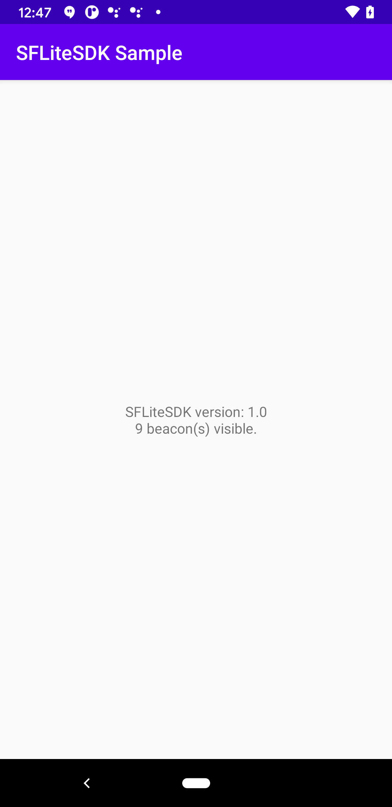

# SFLiteSDKReference Android app

This is a sample Android application that shows how to use the SFLiteSDK.  For an equivalent sample for iOS, see [here](https://github.com/davidgyoung/SFLiteSDKReferenceiOS)

## Running the Reference App

Using Android Studio 4.0+, open build.gradle

Plug in an Android 5+ device for which you have development enabled
Choose to run the app on that phone, then choose Run -> Run App

You should see something like this:




## Adding the SDK to Your Own Project.

1. Modify your outermost `build.gradle` file so that it includes a flatDir repository pointing to a libs folder like this:
```
allprojects {
    repositories {
        google()
        jcenter()
        flatDir { dirs 'libs' }
    }
}
```

2. Copy the `SFLiteSDK-XXX.aar` file from this project and place it in a new `libs` folder that is next to your innermost `build.gradle` file.

3. Modify your innermost build.gradle file to include the following dependencies:

```
dependencies {
    // This file is in /libs
    // Be sure you also specify add a line like this in your repository declaration in your
    // outermost build.gradle file: flatDir { dirs 'libs' }
    implementation 'com.signalframe:SFLiteSDK:1+@aar'
    // The following are dependencies of the SFLiteSDK and must be included
    implementation 'org.altbeacon:android-beacon-library:2.17.1'
    implementation "org.jetbrains.kotlin:kotlin-stdlib:1.3"
    implementation 'androidx.core:core-ktx:1.3.1'
    implementation 'androidx.appcompat:appcompat:1.2.0'
    implementation 'androidx.localbroadcastmanager:localbroadcastmanager:1.0.0'
    implementation 'org.jetbrains.kotlinx:kotlinx-coroutines-core:1.3.2'
    implementation "org.jetbrains.kotlinx:kotlinx-coroutines-android:1.3.2"
    implementation "androidx.lifecycle:lifecycle-runtime-ktx:2.2.0"
}
```

4. Modify your app's AndroidManifest.xml so that it contains:

```
    <uses-permission android:name="android.permission.FOREGROUND_SERVICE"/>
    <uses-permission android:name="android.permission.INTERNET"/>
    <uses-permission android:name="android.permission.ACCESS_BACKGROUND_LOCATION" />
    <uses-permission android:name="android.permission.ACCESS_FINE_LOCATION" />

    <application
        android:name=".MyApplication"
        ...
    </application>
```

The above permissions must be present.  The application entry must specify a name that points to an Application class definition in your project.  If you do not already have one, you must create one.  The next
step describes what you must put in that class for this SDK to function.

5. Add the following to your custom Application class defined in the AndroidManifest.xml file.  This code is needed to start up the SDK and to create a foreground
service notification for when the app is runnning in the background.  This notification is a requriement on Android 8+ so it can conitnue scanning for beacons in
the background.  You may customize the text it displays and the Activity it launches on tap to your liking.

```
public class MyApplication extends Application {
    public void onCreate() {
        super.onCreate();
        // You must set up the SDK here for background detections
        final SFBeaconManager beaconManager = SFBeaconManager.Companion.getInstance(this);

        beaconManager.setClient("acme"); // This should be your company name registered with the servers
        beaconManager.setEmail("test@test.com"); // This should be the logged in user

        // When the SDK runs in the background on Android 8+ devices, it must display a persistent
        // notification to the user to indicate it is running.  The code below shows how you
        // customize this notificaton
        if (Build.VERSION.SDK_INT >= Build.VERSION_CODES.O) {
            Notification.Builder builder = new Notification.Builder(this, "Foreground Service Channel");
            builder.setSmallIcon(R.drawable.notification_icon_background);
            builder.setContentTitle("Scanning for Beacons");
            NotificationChannel channel =  new NotificationChannel("Foreground Service Channel",
                    "Foreground Service Channel", NotificationManager.IMPORTANCE_DEFAULT);
            channel.setDescription("Lets you know when the app is running in the background.");
            NotificationManager notificationManager =  (NotificationManager) this.getSystemService(
                    Context.NOTIFICATION_SERVICE);
            notificationManager.createNotificationChannel(channel);
            builder.setChannelId(channel.getId());
            TaskStackBuilder stackBuilder =  TaskStackBuilder.create(this);
            stackBuilder.addNextIntent(new Intent(this, MainActivity.class));
            PendingIntent resultPendingIntent = stackBuilder.getPendingIntent(
                    0,
                    PendingIntent.FLAG_UPDATE_CURRENT
            );
            builder.setContentIntent(resultPendingIntent);
            beaconManager.foregroundServiceNotification = builder.build();
        } else {
            Notification.Builder builder =  new Notification.Builder(this);
            builder.setSmallIcon(R.drawable.notification_icon_background);
            builder.setContentTitle("Scanning for Beacons");
            Intent intent = new Intent(this, MainActivity.class);
            PendingIntent pendingIntent = PendingIntent.getActivity(
                    this, 0, intent, PendingIntent.FLAG_UPDATE_CURRENT
            );
            builder.setContentIntent(pendingIntent);
            beaconManager.foregroundServiceNotification = builder.build();
        }

        beaconManager.start();
    }
}
```

6. Add code to your launch Activity to request location permissions from the user.  CAUTION:  This is a complex process, especialy on Android 10+, so we recommend
you use the code as shown below unless you are confident in making changes.

```
    private static final int PERMISSION_REQUEST_BACKGROUND_LOCATION = 1;
    private static final int PERMISSION_REQUEST_FINE_LOCATION = 2;

    @Override
    public void onResume() {
        super.onResume();
        if (Build.VERSION.SDK_INT >= Build.VERSION_CODES.M) {
            checkPermissions();
        }
    }

    // Code needed to request and obtain background location permission from the user is complex
    // as of Android 6.0, and more complex as of Android 11.0.  We recommend you use the following
    // method to get these permissions, and execute it whenever the Activity resumes.  Code below
    // should be modified only if you are confident you know how this all works.  Please feel free
    // to customize the text messaging to the user as you see fit for your application.
    @RequiresApi(Build.VERSION_CODES.M)
    private void checkPermissions() {
        if (checkSelfPermission(Manifest.permission.ACCESS_FINE_LOCATION) == PackageManager.PERMISSION_GRANTED) {
            int backgroundGrantStatus = checkSelfPermission(Manifest.permission.ACCESS_BACKGROUND_LOCATION);
            if (backgroundGrantStatus  != PackageManager.PERMISSION_GRANTED ) {
                if (shouldShowRequestPermissionRationale(Manifest.permission.ACCESS_BACKGROUND_LOCATION)) {
                    AlertDialog.Builder builder =
                            new AlertDialog.Builder(this);
                    builder.setTitle("This app needs background location access");
                    builder.setMessage("Please grant location access so this app can detect beacons in the background.");
                    builder.setPositiveButton(android.R.string.ok, null);
                    builder.setOnDismissListener(new DialogInterface.OnDismissListener() {

                        @TargetApi(23)
                        @Override
                        public void onDismiss(DialogInterface dialog) {
                            requestPermissions(new String[]{Manifest.permission.ACCESS_BACKGROUND_LOCATION},
                                    PERMISSION_REQUEST_BACKGROUND_LOCATION);
                        }

                    });
                    builder.show();
                } else {
                    if (android.os.Build.VERSION.SDK_INT >= android.os.Build.VERSION_CODES.Q) {
                        AlertDialog.Builder builder =
                                new AlertDialog.Builder(this);
                        builder.setTitle("'Allow All the Time' Location Access Required");
                        builder.setMessage("Please go to Permissions -> Location and grant this app 'Allow All the Time' access");
                        builder.setPositiveButton(android.R.string.ok, null);
                        builder.setOnDismissListener(new DialogInterface.OnDismissListener() {

                            @TargetApi(23)
                            @Override
                            public void onDismiss(DialogInterface dialog) {
                                // Tragically, there is no way to link directly to the Permissions page of the app.  The best you can do is link to the
                                // general settings page.
                                startActivity(new Intent(android.provider.Settings.ACTION_APPLICATION_DETAILS_SETTINGS, Uri.parse("package:" + BuildConfig.APPLICATION_ID)));
                            }

                        });
                        builder.show();
                    }
                }
            }
        } else {
            if (shouldShowRequestPermissionRationale(Manifest.permission.ACCESS_FINE_LOCATION)) {
                requestPermissions(new String[]{Manifest.permission.ACCESS_FINE_LOCATION},
                                PERMISSION_REQUEST_FINE_LOCATION);
            } else {
                AlertDialog.Builder builder = new AlertDialog.Builder(this);
                builder.setTitle("Functionality limited");
                builder.setMessage("Since location access has not been granted, this app will not be able to discover beacons.  Please go to Settings -> Applications -> Permissions and grant location access to this app.");
                builder.setPositiveButton(android.R.string.ok, null);
                builder.show();
            }
        }
    }
```